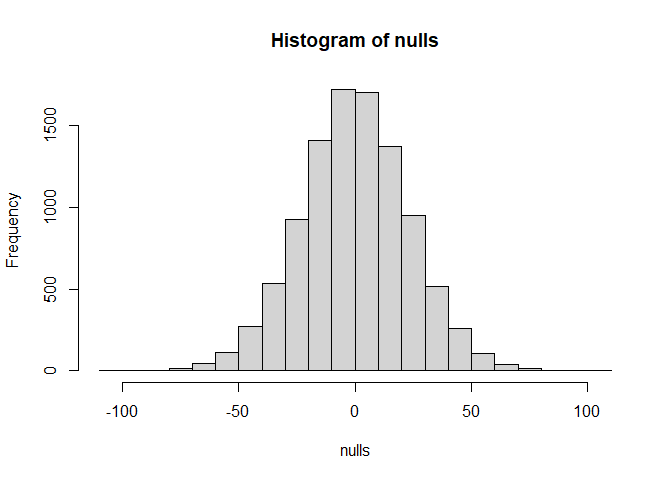
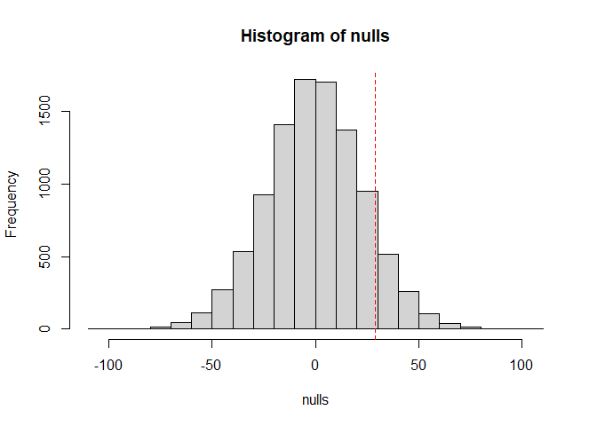
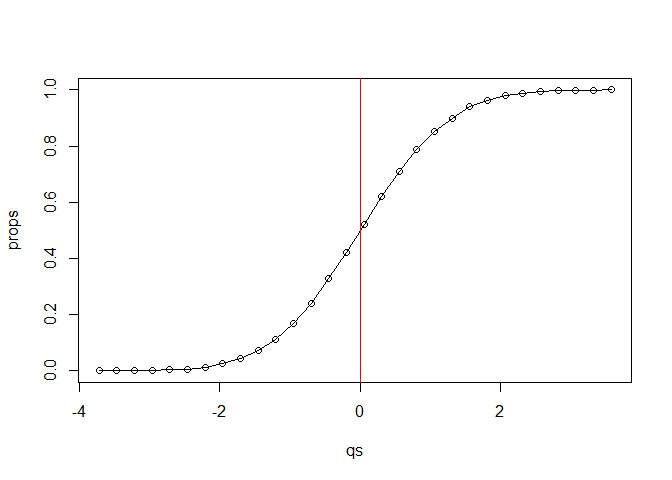
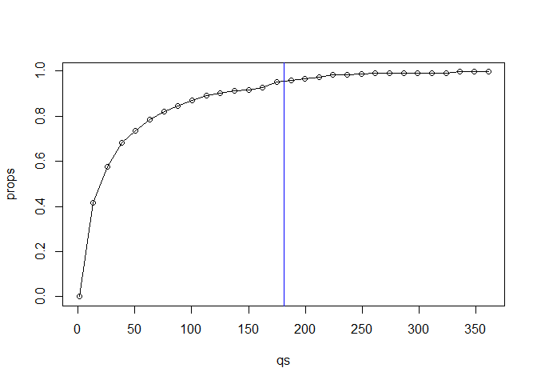
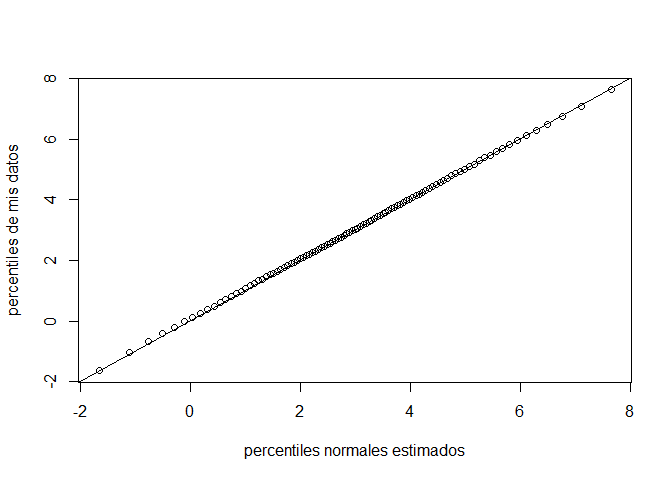
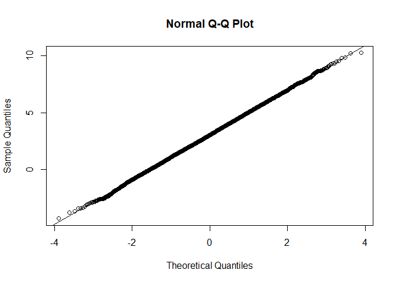

## 1. Generación de números Aleatorios
Se trata de funciones que nos permiten generar números aleatorios de distribuciones de probabilidad.

        rnorm(): Simula una serie de números aleatorios
                 con una media y sd dados.
        rpois(): Simula una serie de números aleatorios
                 para una distribución de poisson
        rbinom(): Simula una serie de números aleatorios
                 para una distribución binomial
        runif(): Simula una serie de números aleatorios 
                 para una distribución uniforme.

Las funciones de distribución igualmente tienen 4 prefijos asociadas a ellas.

        d: evlua la densidad de distribución de probabilidad
           en un punto o vector de puntos
        r: Random number generator
        p: Evalúa la distribución acumulativa
        q: Evalúa la función de cuantiles

Los argumentos cambian según el prefijo:

```r
set.seed(30) ##importante establecer la semilla

dnorm(30,40, 4)
```

```
## [1] 0.004382075
```

```r
##sinónimos
pnorm(25, 40, 4)
```

```
## [1] 8.841729e-05
```

```r
1-pnorm(25, 40, 4)
```

```
## [1] 0.9999116
```

```r
##cuantiles
qnorm(.9, 40, 4)
```

```
## [1] 45.12621
```

```r
## generación aleatoria
rnorm(30, 40, 4)
```

```
##  [1] 34.84593 38.60924 37.91348 45.09389 47.29808 33.95477 40.44203 36.95682
##  [9] 37.32041 41.09808 35.90691 32.72241 37.32884 39.76281 43.52066 41.07405
## [17] 39.92168 37.90021 34.36267 32.66404 39.36674 43.01771 36.35148 43.19972
## [25] 45.96221 35.61439 37.86312 34.31519 35.02905 40.92774
```

## 2. Distribución Nula
Situación inicial


```r
## 1. Reading data
### control
poblacionctrl <- xlsx::read.xlsx("./data/Experimento 1.xlsx", sheetIndex = 1, colIndex = 1:15, startRow = 4, header = TRUE)
### experimental
poblacionexp <- xlsx::read.xlsx("./data/Experimento 1.xlsx", sheetIndex = 3, colIndex = 1:15, startRow = 4, header = TRUE)
## 2. Filtrando datos y arreglando la tabla
### control
poblacionctrl <- poblacionctrl[, c("Slice", "Count", "Total.Area", "Circularity", "Solidity")]
poblacionctrl$Circularity <- as.numeric(poblacionctrl$Circularity)
poblacionctrl$Solidity <- as.numeric(poblacionctrl$Solidity)
###experimental
poblacionexp <- poblacionexp[, c("Slice", "Count", "Total.Area", "Circularity", "Solidity")]
poblacionexp$Circularity <- as.numeric(poblacionexp$Circularity)
poblacionexp$Solidity <- as.numeric(poblacionexp$Solidity)
## 3. Quitando valores perdidos
poblacionctrl <- na.omit(poblacionctrl)
poblacionexp <- na.omit(poblacionexp)
## 4. Variable Conteos
conteos.ctrl <- poblacionctrl$Count 
conteos.exp <- poblacionexp$Count
boxplot(conteos.ctrl, conteos.exp)
```

<!-- -->

```r
## 5. Diferencia de ambas medias. La diferencia es el tamaño 
## del efecto real, en este caso porque tenemos toda la pob.
diffobs <- mean(conteos.exp)-mean(conteos.ctrl)
diffobs
```

```
## [1] 28.84823
```

Ahora Imaginemos una situación en donde estamos comparando 2 grupos extraidos de una población (**Y TENEMOS ACCESO A ELLA**) en donde H0 es verdadera, es decir, no hay diferencias entre las medias de ambos grupos.

La distribución nula es básicamente todas las realizaciones bajo la curva de H0: Si conoces la distribución nula, puedes describir la proporción de valores que ves para cualquier intervalo.

Entonces vamos a comparar estas medias supuestamente donde H0 es verdadera 10,000 veces.


```r
## Obtenemos la población completa
poblacion <- c(conteos.ctrl, conteos.exp)
hist(poblacion)
```

<!-- -->

```r
##comparamos las medias unas cuantas veces
ctrl <- sample(poblacion, 12)
exp <- sample(poblacion, 12)
mean(ctrl)-mean(exp)
```

```
## [1] -2.333333
```

```r
## comparamos 10,000 veces
n <- 10000
nulls <- numeric(n)
for(i in 1:n){
        control <- sample(poblacion, 12)
        exper <- sample(poblacion, 12)
        nulls[i] <- mean(control)-mean(exper)
}
## Distribución de la H0 (asumiendo que tengamos acceso
## a los datos de la población total)
hist(nulls)
```

<!-- -->
Nuestra diferencia observada es de 28.84. Esta distribución  nos da una ide a de qué tan probable es ver valores tan grandes como nuestra diferencia observada.

Veamos la proporción de veces que el valor nulo en la dist. nula, fuese más grande que la observación original (28.4) entre controles y experimentales.

Básicamente es el 10% de las veces.

```r
mean(nulls > diffobs)
```

```
## [1] 0.1031
```

Es decir,**si nuestra hipótesis nula es cierta**, de las observaciones originales, qué tan probable es que nos salga un resultado mayor al de la distribución nula. EL VALOR P DE LA DISTRIBUCION NULA.


```r
##VALOR P
mean(abs(nulls)>diffobs)
```

```
## [1] 0.2085
```

```r
##Posición en la curva
hist(nulls)
abline(v=diffobs, lty=2, col="red")
```

<!-- -->

## 3. Distribución de probabilidad
Como vimos, el histograma nos ayuda a resumir datos. Y podemos obtener la proporción de un número debajo de un valor dado y podemos saber cuantos individuos hay dentro de un intervalo.

Saber la distribución de los valores de los sujetos de una lista nos ayuda a saber la probabilidad de escoger a un sujeto dentro de la curva.

        Para obtener una proporción utilizamos la
        siguiente expresión mean(x<=a)
        
Por ejemplo, buscaremos la proporción de cada dato dentro de un rango:


```r
##EN UNA DISTRIBUCION NORMAL
# 1. Creamos la secuencia de datos
set.seed(40)
dat <- rnorm(10000)
qs <- seq(from=min(dat), to=max(dat), length.out = 30)
# 2. Sacamos la prop de cada dato
props <- sapply(qs, function(q) mean(dat<q))
# 3. Graficamos
plot(qs, props, type = "o")
abline(v=mean(dat), col="red")
```

<!-- -->

```r
##EN UN SET DE DATOS REAL.
qs <- seq(from=min(poblacion), to=max(poblacion), length.out = 30)
# 2. Sacamos la prop de cada dato
props <- sapply(qs, function(q) mean(poblacion<q))
# 3. Graficamos
plot(qs, props, type = "o")
abline(v=mean(qs), col="blue")
```

<!-- -->
## 4. Distribución Normal
La curva normal o campana de Gauss es básicamente una distribución en donde la media es el valor central de los datos. Las características de una distribución normal son.

$\sigma$ : Desviación estandar
$\mu$ : Media 

El 68.2% de los datos están a 1 desviación estandar de la media.

El 95% de los datos están a 2 desviaciones estandar de la media.

el 99% de los datos están a 3 desviaciones estandar de la media


```r
set.seed(22)
norm <- rnorm(1000, 3, 4)
hist(norm, breaks = 15)
abline(v=mean(norm), col=6, lwd=2)
abline(v=c(qnorm(.68, 3, 4), qnorm(.34, 3,4)), 
       lty=2, lwd=1.5, col="blue")
abline(v=c(qnorm(.95, 3, 4), qnorm(.07,3,4)), 
       lty=2, lwd=1.5, col=4)
abline(v=c(qnorm(.99, 3, 4), qnorm(.01,3,4)), 
       lty=2, lwd=1.5, col=9)
```

<!-- -->

### Q-Q plot
A pesar de que el histograma nos ayuda a observar y darnos una idea de si una distribución es normal, es conveniente utilizar otro tipo de gráfica llamada *Q-Q plot* o grafica de cuantil cuantil. Lo que hace esta gráfica es comparar los percentiles estimados de una distribución normal y los compara con los percentiles de nuestros datos. Si esta distribución es normal, deben caer los puntos dentro de la línea de identidad.

Por ejemplo: 


```r
##DATOS NORMALES
set.seed(32)
data <- rnorm(10000, 3, 2)
##percentiles
ps <- seq(0.01, .99, .01)
##distribución de percentiles si fuera normal
##(percentiles estimados)
normal.qs <- qnorm(ps,3,2)
##percentiles de mis datos
qs <- quantile(data,ps)

##graficamos
qqplot(normal.qs, qs, xlab = "percentiles normales estimados",
     ylab = "percentiles de mis datos")
abline(0,1)
```

<!-- -->

Intentemoslo con datos reales

```r
##DATOS REALES
##percentiles
ps <- seq(0.01, .99, .01)
##distribución de percentiles si fuera normal
##(percentiles estimados)
normal.qs <- qnorm(ps,mean(poblacion),sd(poblacion))
##percentiles de mis datos
qs <- quantile(poblacion,ps)
##graficamos
plot(normal.qs, qs, xlab = "percentiles normales estimados",
     ylab = "percentiles de mis datos")
abline(0,1)
```

<!-- -->

De esta manera podemos corroborar que nuestros datos efectivamente no son normales. Sin embargo, podemos hacer todo esto de forma más sencilla.

```r
qqnorm(poblacion)
qqline(poblacion)
```

<!-- -->

```r
qqnorm(data)
qqline(data)
```

<!-- -->

